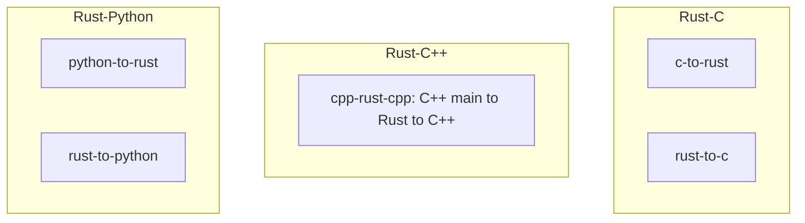

# Rust FFI Demo Projects

Rust projects demonstrating Foreign Function Interface (FFI) with C, C++, and Python.

## Projects

| Project | Description |
|---------|-------------|
| [c-to-rust](c-to-rust/) | C executable calls Rust cdylib |
| [rust-to-c](rust-to-c/) | Rust binary calls C |
| [cpp-rust-cpp](cpp-rust-cpp/) | C++ main → Rust → C++ round-trip with shared structs |
| [python-to-rust](python-to-rust/) | Python imports Rust PyO3 extension |
| [rust-to-python](rust-to-python/) | Rust binary embeds Python |

## Prerequisites

| Project | Requirements |
|---------|-------------|
| c-to-rust | Rust, C compiler (gcc/clang) |
| rust-to-c | Rust, C compiler |
| cpp-rust-cpp | Rust, C++ compiler (g++/clang++) |
| python-to-rust | Rust, Python 3.8+, `pip install maturin` |
| rust-to-python | Rust, Python 3.8+ with dev headers |

## Quick Start

```bash
# C → Rust
cd c-to-rust && make && make run

# Rust → C
cd rust-to-c && cargo run

# C++ → Rust → C++ round-trip
cd cpp-rust-cpp && make && make run

# Python → Rust
cd python-to-rust && maturin develop && python examples/demo.py

# Rust → Python
cd rust-to-python && cargo run
```

## Testing

Run all tests:

```bash
./scripts/test_all.sh
```

Or run each project's tests individually:

| Project | Command |
|---------|---------|
| c-to-rust | `cd c-to-rust && make test` |
| rust-to-c | `cd rust-to-c && cargo test` |
| cpp-rust-cpp | `cd cpp-rust-cpp && make test` |
| python-to-rust | `cd python-to-rust && maturin develop && pytest tests/ -v` |
| rust-to-python | `cd rust-to-python && cargo run` |

## Overview


